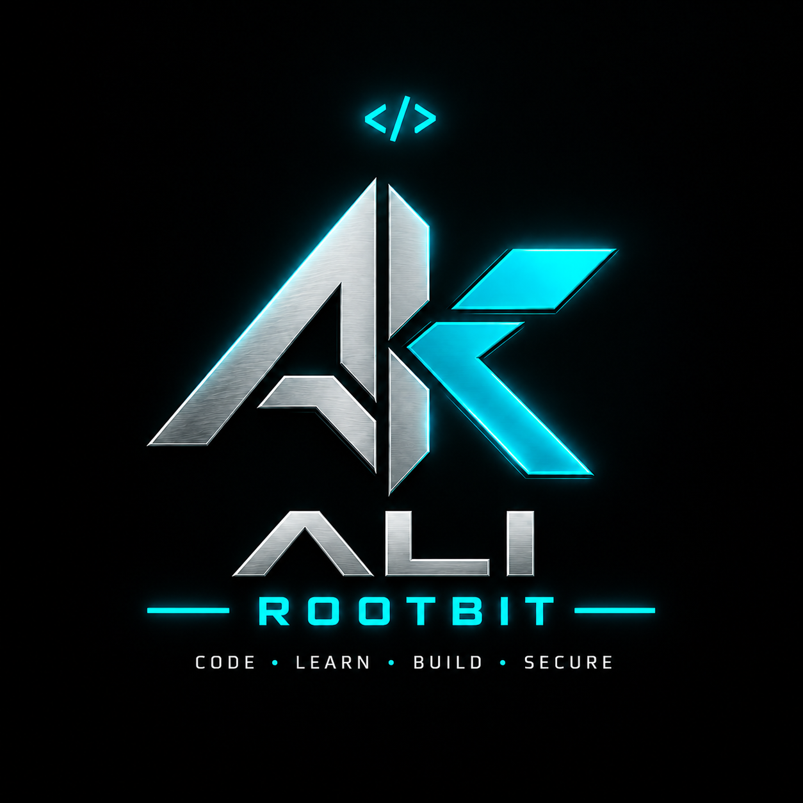

<div align="center">



# RootBit 👨‍💻

### Backend Developer • Cyber Security

*Build systems. Understand vulnerabilities. Secure the web.*

🔐 Security Mindset • ⚙️ Backend Development • 🧠 Continuous Learning

</div>

---

## 🧠 About RootBit

RootBit is my personal identity for exploring **Backend Development** and **Cyber Security**.

I enjoy understanding how software and web applications work, building backend systems, studying vulnerabilities, and learning how to make applications more secure.

* 💻 Building backend applications and APIs
* 🔐 Exploring web security and vulnerability research
* 🐧 Working with Linux and security tools
* ⚙️ Learning software engineering and clean code
* 🚀 Building projects to turn knowledge into practical experience

---

## 🛠️ Tech Stack

### 💻 Development


### 🐧 Environment & Tools


### 🔐 Security


---

## 🎯 Focus Areas

### ⚙️ Backend Development

Designing and building backend systems, APIs and server-side applications with a focus on clean structure, reliability and security.

### 🔐 Cyber Security

Learning web application security, vulnerability research, reconnaissance and defensive security practices through legal labs and controlled environments.

### 🌐 Web Security

Understanding how web applications work and how vulnerabilities can affect authentication, authorization, input handling and application logic.

### 🧩 Secure Software

Learning to think about security while designing and developing software — not only after something goes wrong.

---

## 📚 Currently Learning

```text
Backend Development     ███████████████░░░  Building
Cyber Security          █████████████░░░░░  Learning
Web Security             █████████████░░░░░  Learning
Linux                    ████████████████░░  Building
Git & GitHub             ██████████████████  Building
Software Architecture    ███████████░░░░░░░  Learning
```

---

## 🔎 Security Mindset

> **Understand the system.
> Find the weakness.
> Build it better.**

My cybersecurity journey focuses on understanding vulnerabilities, application behavior and security concepts through **legal and controlled environments**.

---

## 🚀 What I'm Building

My GitHub will gradually become a collection of practical projects around:

* ⚙️ Backend applications
* 🌐 Web applications
* 🔌 APIs
* 🔐 Security labs
* 🧪 Vulnerability research projects
* 🛠️ Security & developer tools
* 📚 Learning projects

More projects are coming.

---

## 📊 GitHub Stats

<div align="center">


</div>

---

## 🐍 Contribution

<div align="center">


</div>

---

## 📬 Connect With RootBit

<div align="center">

<a href="https://github.com/alikhosravi-codes">

</a>

</div>

---

<div align="center">

### `root@rootbit:~$`

**Learn • Build • Break • Secure**

</div>
